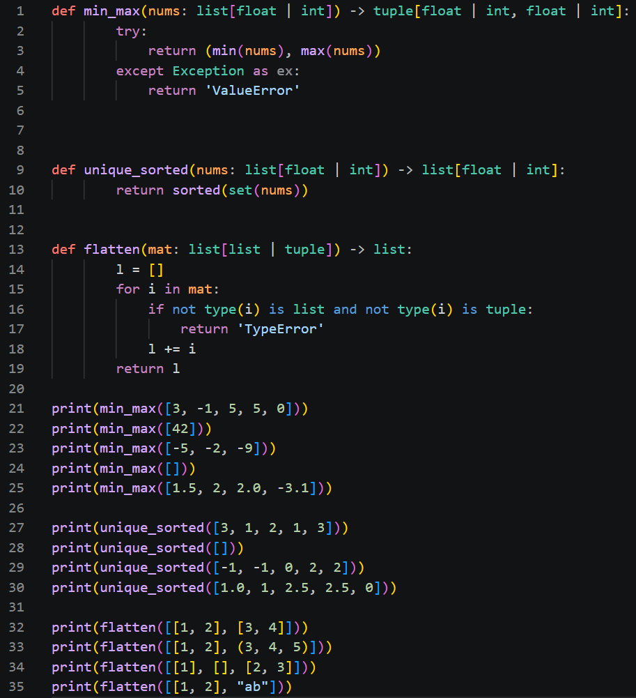
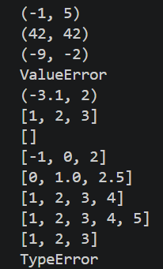
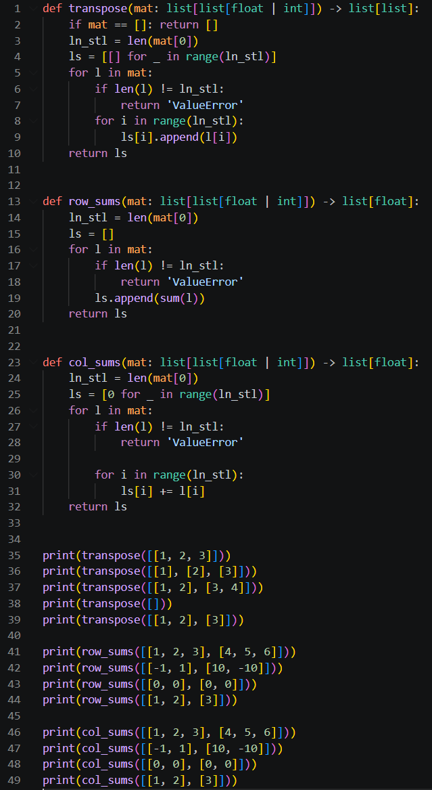
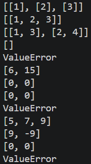
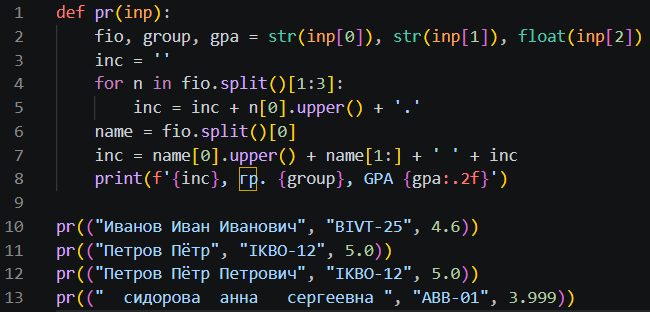
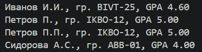

# lab21
## 01_arrays
#### [Код](https://github.com/Mertysh/python_labs/blob/main/src/lab2/01_arrays.py)

#### Вывод

## 02_matrix
#### [Код](https://github.com/Mertysh/python_labs/blob/main/src/lab2/02_matrix.py)

#### Вывод

## 03_tuples
#### [Код](https://github.com/Mertysh/python_labs/blob/main/src/lab2/03_tuples.py)

#### Вывод

